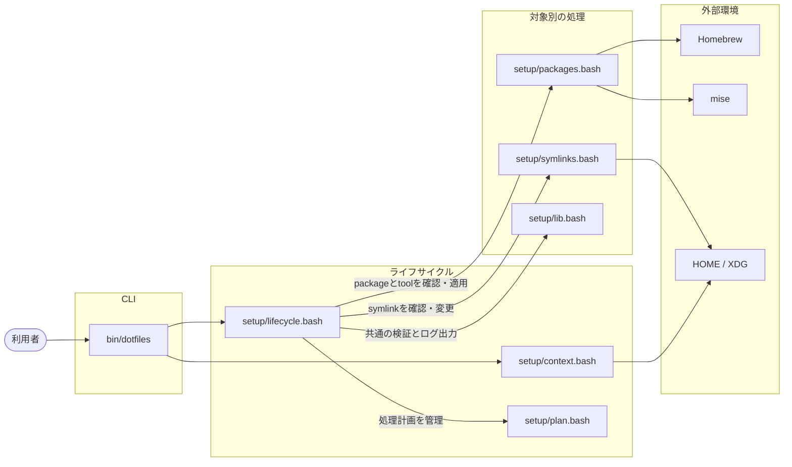
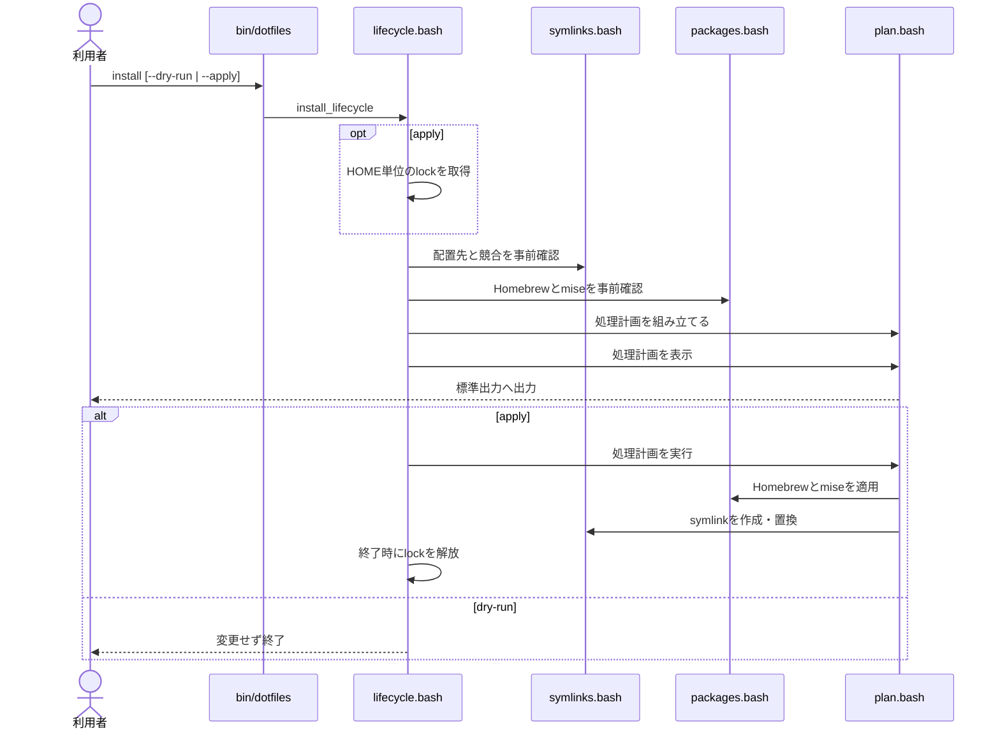

# Architecture

この文書では、リポジトリの構成と内部処理の関係を説明します。利用者向けのコマンドは [Operations](OPERATIONS.md)、エラー時の対応は [Troubleshooting](TROUBLESHOOTING.md) を参照してください。

## 全体構成

矢印は、始点の処理が終点のファイルまたは外部環境を利用する方向を示します。

[bin/dotfiles](../bin/dotfiles) は引数を解析してcontextを初期化し、`install` / `verify` / `uninstall` サブコマンドに応じて [setup/lifecycle.bash](../setup/lifecycle.bash) の処理を呼び出します。ライフサイクルは共通のcontextとplanを使い、packageとsymlinkの処理を進行します。

## install の処理

## ファイルの責務

| ファイル | 担当 |
| --- | --- |
| [bin/dotfiles](../bin/dotfiles) | コマンドと option のインタフェース |
| [setup/lifecycle.bash](../setup/lifecycle.bash) | install / verify / uninstall、lock、事前確認の進行管理 |
| [setup/plan.bash](../setup/plan.bash) | dry-run と apply で共通する処理計画の保持と実行 |
| [setup/packages.bash](../setup/packages.bash) | Homebrew / mise の確認、bootstrap、適用 |
| [setup/symlinks.bash](../setup/symlinks.bash) | 管理対象のシンボリックリンクの定義検証、確認、backup、作成、削除 |
| [setup/context.bash](../setup/context.bash) | HOME / XDG と管理対象パスの決定 |
| [setup/lib.bash](../setup/lib.bash) | 共通の検証とログ出力 |
| [package.json](../package.json) | リポジトリ内のJavaScriptをES Modulesとして扱うための設定 |
| [tests/helpers/](../tests/helpers/) | `node:test` から使う process 実行、共通 assertion、[TestFixture](../tests/helpers/fixture.js) |
| [tests/fixtures/](../tests/fixtures/) | 外部CLIとして実行するテスト用コマンドと入力fixture |
| [tests/integration/](../tests/integration/) | 実shell・実miseとの境界テスト |
| [tests/run.sh](../tests/run.sh) | mise 管理の Node.js で `node:test` を実行する入口 |

設定の解析や package/tool の状態確認には、それぞれの公式コマンドを使います。dotfiles 側では lifecycle と symlink の処理だけを管理します。

[setup/context.bash](../setup/context.bash) は、管理対象のシンボリックリンクを種類・参照元・配置先の3要素で宣言します。install、verify、uninstall は同じ宣言を参照します。install は処理計画の作成時と実行時にも配置先を確認します。確認後に別のプロセスが配置先を変更しても、未検証の置換へ切り替えません。

mise が PATH にない場合は、[setup/mise-install.sh](../setup/mise-install.sh) がリポジトリで指定したバージョンのmise実行ファイルをダウンロードし、platformごとのSHA-256 checksumを照合してインストールします。

repository の mise config と lock file を検査するときは、一時ディレクトリに両ファイルをコピーし、呼び出し元の mise 設定から隔離します。検査結果は stdout と stderr を保持して診断へ使い、[install --apply](../bin/dotfiles) の進捗は端末へ直接流します。準備、mise の実行、cleanup の結果は別々に保持し、mise と cleanup が同時に失敗した場合は mise の終了コードを優先しつつ、両方の診断を表示します。

テストケース、テスト用環境の準備と後片付け、検証は原則として `node:test` で記述します。外部CLIのテスト用コマンド、実shell・実miseとの境界テスト、テスト起動処理にはshellを使います。shellテストで独自の分岐やassertionが増え、境界確認より処理の組み立てが中心になった場合は、`node:test`への移行を検討します。各レイヤーの役割と品質保証の範囲は [テスト戦略](TEST-STRATEGY.md) を参照してください。

Node.js は mise config と lock file で固定し、[tests/run.sh](../tests/run.sh) が管理版を選択します。全Node.jsテストは [tests/run.sh](../tests/run.sh)、mise環境分離の境界だけは [tests/integration/mise-isolation.sh](../tests/integration/mise-isolation.sh) で単独実行できます。[make lint](../Makefile) は構文検査とBiome、[make test](../Makefile) は両方のテストを実行します。[make check](../Makefile) はlintとtestをこの順に実行します。

## 管理対象

- [.bashrc](../.bashrc)、[.bash_profile](../.bash_profile)、[.gitconfig](../.gitconfig)、mise config の symlink
- [Brewfile](../Brewfile) に記載した package
- mise lock に記載した tool

symlink は repository 内の source と HOME/XDG 配下の destination を絶対パスで結びます。[.bashrc](../.bashrc) は symlink の参照先を辿って repository root を求め、mise config は自身の実体パスから同じ root を求めます。そのため clone 先を設定ファイルへ固定で記録しません。

uninstall は現在の repository を指す symlink だけを削除します。package/tool、backup、以前のバージョンが作成した状態管理ファイルは削除しません。

## 排他制御と失敗時の扱い

[install --apply](../bin/dotfiles) と [uninstall --apply](../bin/dotfiles) は `$HOME/.dotfiles-lifecycle.lock` を使い、同じ HOME に対する変更を直列化します。dry-run と verify は lock を作成しません。

package manager の処理が途中で失敗しても、dotfiles 側では元に戻しません。原因を解消して install を再実行します。symlink の作成に失敗した場合だけ、直前に作成した backup を戻します。
