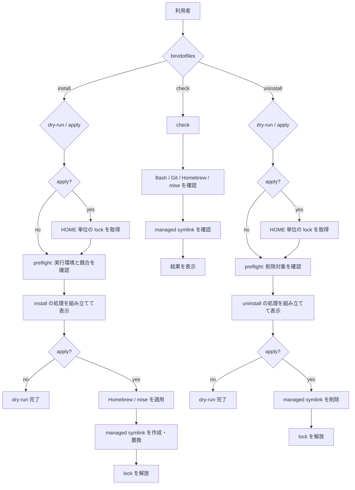

# Architecture

この文書では、リポジトリの構成と内部処理の関係を説明します。利用者向けのコマンドは [Operations](OPERATIONS.md)、エラー時の対応は [Troubleshooting](TROUBLESHOOTING.md) を参照してください。

## 全体の流れ

`preflight` は install / uninstall の内部処理です。変更前に実行環境、必要なコマンド、対象パス、symlink の競合を確認します。dry-run と apply のどちらでも実行します。

`check` は独立したコマンドです。現在の環境が期待どおりか確認しますが、処理計画の作成や修復は行いません。

## ファイルの責務

| ファイル | 担当 |
| --- | --- |
| `bin/dotfiles` | コマンドと option の受付 |
| `setup/lifecycle.bash` | install / check / uninstall、lock、preflight の進行管理 |
| `setup/plan.bash` | dry-run と apply で共通する処理計画の保持と実行 |
| `setup/packages.bash` | Homebrew / mise の確認、bootstrap、適用 |
| `setup/resources.bash` | managed symlink の確認、backup、作成、削除 |
| `setup/context.bash` | HOME / XDG と管理対象パスの決定 |
| `setup/lib.bash` | 共通の検証とログ出力 |

設定の解析や package/tool の状態確認には、それぞれの公式コマンドを使います。dotfiles 側では lifecycle と symlink の処理だけを管理します。

mise が PATH にない場合は、`setup/mise-install.sh` が repository に固定した mise version と platform ごとの SHA-256 checksumを照合して、公式 release asset をインストールします。

## 管理対象

- `.bashrc`、`.bash_profile`、`.gitconfig`、mise config の symlink
- `Brewfile` に記載した package
- mise lock に記載した tool

symlink は repository 内の source と HOME/XDG 配下の destination を絶対パスで結びます。`.bashrc` は symlink の参照先を辿って repository root を求め、mise config は自身の実体パスから同じ root を求めます。そのため clone 先を設定ファイルへ固定で記録しません。

uninstall は現在の repository を指す symlink だけを削除します。package/tool、backup、既存の state file は削除しません。

## 排他制御と失敗時の扱い

`install --apply` と `uninstall --apply` は `$HOME/.dotfiles-lifecycle.lock` を使い、同じ HOME に対する変更を直列化します。dry-run と check は lock を作成しません。

package manager の処理が途中で失敗しても、dotfiles 側では元に戻しません。原因を解消して install を再実行します。symlink の作成に失敗した場合だけ、直前に作成した backup を戻します。
