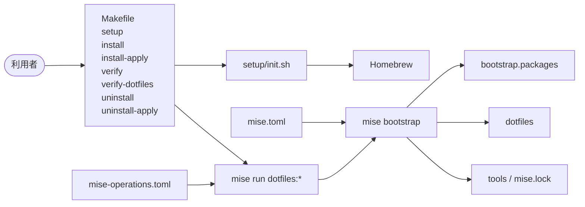

# 構成

## 処理の流れ

```mermaid
%%{init: {"flowchart": {"htmlLabels": true}}}%%
flowchart LR
    user([利用者]) --> makefile["<div style='text-align: left'>Makefile<br/>setup<br/>install<br/>install-apply<br/>verify<br/>verify-dotfiles<br/>uninstall<br/>uninstall-apply</div>"]
    makefile --> setup[setup/init.sh]
    setup --> brew[Homebrew]
    config[mise.toml] --> mise
    operations[mise-operations.toml] --> tasks
    makefile --> tasks[mise run dotfiles:*]
    tasks --> mise[mise bootstrap]
    mise --> packages[bootstrap.packages]
    mise --> dotfiles[dotfiles]
    mise --> tools[tools / mise.lock]
```

利用者はリポジトリルートの Makefile から操作します。`setup` は直接スクリプトを実行し、それ以外の操作は `mise-operations.toml` のタスクを呼び出します。タスクから Makefile は呼びません。

### mise bootstrap の前処理
`setup` は mise bootstrap の実行に必要な Homebrew と mise 本体を準備します。bootstrap 自体は実行しません。

### mise bootstrap
Makefile をエントリポイント、mise のタスク経由で bootstrap を操作します。

| Target | 動作 |
| --- | --- |
| `setup` | Homebrew と mise 本体を準備 |
| `install` | mise bootstrap を dry-run |
| `install-apply` | mise bootstrap を適用 |
| `verify` | bootstrap 全体の状態を確認 |
| `verify-dotfiles` | dotfile の状態を確認 |
| `uninstall` | dotfile 解除を dry-run |
| `uninstall-apply` | mise 管理の dotfile を解除 |

> [!NOTE]
>
> **対象外:** `uninstall-apply` は Homebrew、mise 本体、パッケージ、開発ツールを削除しません。
>
> `setup` で準備した環境をどこまで削除するかは利用状況によって異なるため、インストール前の状態へ戻す処理は用意していません。

## 設定とリンク

ルートの `mise.toml` が bootstrap の宣言元です。`[dotfiles]` は、この設定ファイルと同じディレクトリにある `.bashrc`、`.bash_profile`、`.gitconfig` と `mise.toml` を symlink します。リンク元には相対パスを使い、任意の clone 先から適用できます。`~/.dotfiles` も checkout へのリンクとして管理し、Git フックは `~/.dotfiles/git/hooks` を参照します。

`[bootstrap.packages]` は Homebrew の `git` を管理します。開発ツールは `[tools]` と `mise.lock` で管理します。secretlint のグローバル Git hook はこのリポジトリの `git/hooks/pre-commit` にあり、Docker イメージのバージョンと digest を固定しています。Git Credential Manager は端末ごとに導入し、Git 設定を `~/.gitconfig.local` に保存します。手順は [GCM の設定](GCM.md)を参照してください。

## ファイルの役割

| ファイル | 役割 |
| --- | --- |
| [setup/init.sh](../setup/init.sh) | Homebrew、checkout の確認、mise の準備 |
| [Makefile](../Makefile) | setup と mise タスクを呼び出すエントリポイント |
| [mise.toml](../mise.toml) | パッケージ、dotfile、開発ツールの宣言 |
| [mise-operations.toml](../mise-operations.toml) | 導入・解除・状態確認・テストのタスクと、操作用の設定 |
| [git/hooks/pre-commit](../git/hooks/pre-commit) | 固定イメージを使うグローバル secretlint hook |
| [setup/mise-install.sh](../setup/mise-install.sh) | 固定バージョンの mise を checksum 検証付きで導入 |

## 失敗時の処理

mise bootstrap は宣言された処理を順に適用します。途中で失敗すると、それまでに完了した処理は残ります。出力から原因を特定して解消し、dry-run で確認してから再実行してください。同じ HOME への適用・解除は同時に実行しないでください。一括 rollback や、独自の事前検査は行いません。

`make uninstall-apply` は `mise bootstrap dotfiles unapply` を実行します。mise 本体、Homebrew、パッケージ、開発ツール、リポジトリは削除しません。
