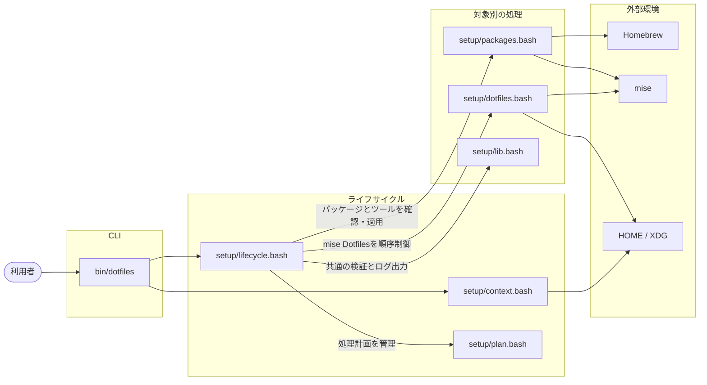
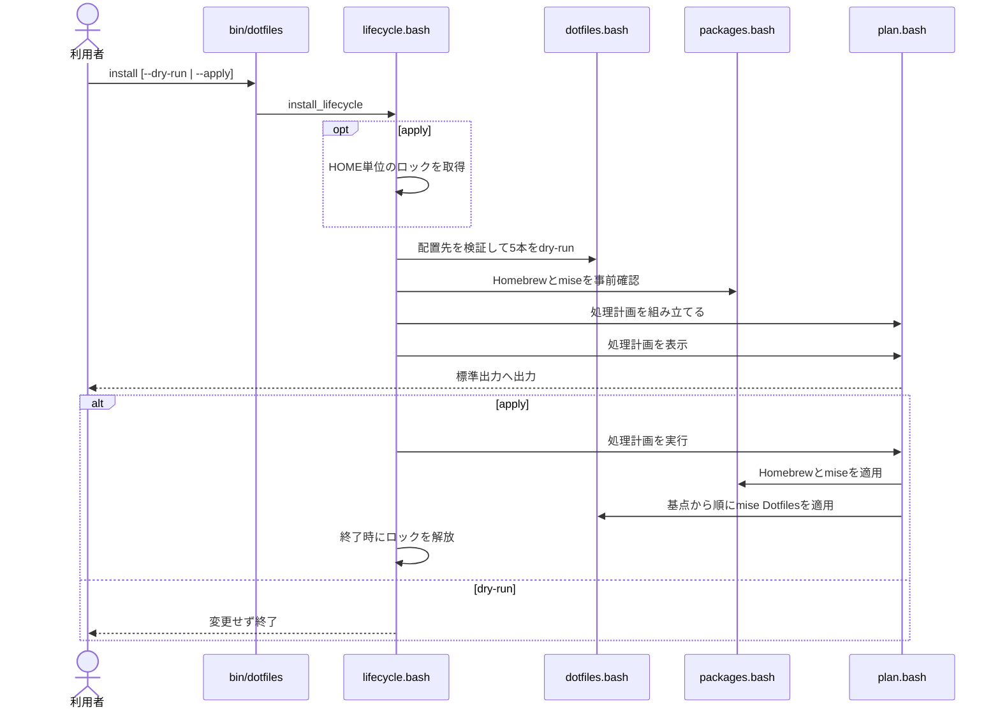

# Architecture

この文書では、リポジトリの構成と内部処理の関係を説明します。利用者向けのコマンドは [Operations](OPERATIONS.md)、エラー時の対応は [Troubleshooting](TROUBLESHOOTING.md) を参照してください。

## 全体構成

```mermaid
flowchart LR
    user([利用者])

    subgraph cli[CLI]
        command[bin/dotfiles]
    end

    subgraph core[ライフサイクル]
        lifecycle[setup/lifecycle.bash]
        context[setup/context.bash]
        plan[setup/plan.bash]
    end

    subgraph adapters[対象別の処理]
        packages[setup/packages.bash]
        dotfiles[setup/dotfiles.bash]
        lib[setup/lib.bash]
    end

    subgraph external[外部環境]
        brew[Homebrew]
        mise[mise]
        home[HOME / XDG]
    end

    user --> command
    command --> context
    command --> lifecycle
    lifecycle -->|処理計画を管理| plan
    lifecycle -->|パッケージとツールを確認・適用| packages
    lifecycle -->|mise Dotfilesを順序制御| dotfiles
    lifecycle -->|共通の検証とログ出力| lib
    packages --> brew
    packages --> mise
    dotfiles --> mise
    dotfiles --> home
    context --> home
```

矢印は、始点の処理が終点のファイルまたは外部環境を利用する方向を示します。

[bin/dotfiles](../bin/dotfiles) は引数を解析してコンテキストを初期化し、`install` / `verify` / `uninstall` サブコマンドに応じて [setup/lifecycle.bash](../setup/lifecycle.bash) の処理を呼び出します。ライフサイクルは共通のコンテキストと実行計画を使い、パッケージとmise Dotfilesの処理を進行します。

## install の処理

```mermaid
sequenceDiagram
    actor User as 利用者
    participant CLI as bin/dotfiles
    participant Lifecycle as lifecycle.bash
    participant Dotfiles as dotfiles.bash
    participant Packages as packages.bash
    participant Plan as plan.bash

    User->>CLI: install [--dry-run | --apply]
    CLI->>Lifecycle: install_lifecycle

    opt apply
        Lifecycle->>Lifecycle: HOME単位のロックを取得
    end

    Lifecycle->>Dotfiles: 配置先を検証して5本をdry-run
    Lifecycle->>Packages: Homebrewとmiseを事前確認
    Lifecycle->>Plan: 処理計画を組み立てる
    Lifecycle->>Plan: 処理計画を表示
    Plan-->>User: 標準出力へ出力

    alt apply
        Lifecycle->>Plan: 処理計画を実行
        Plan->>Packages: Homebrewとmiseを適用
        Plan->>Dotfiles: 基点から順にmise Dotfilesを適用
        Lifecycle->>Lifecycle: 終了時にロックを解放
    else dry-run
        Lifecycle-->>User: 変更せず終了
    end
```

## ファイルの責務

| ファイル | 担当 |
| --- | --- |
| [bin/dotfiles](../bin/dotfiles) | コマンドとオプションのインタフェース |
| [setup/lifecycle.bash](../setup/lifecycle.bash) | install / verify / uninstall、ロック、事前確認の進行管理 |
| [setup/plan.bash](../setup/plan.bash) | dry-run と apply で共通する処理計画の保持と実行 |
| [setup/packages.bash](../setup/packages.bash) | Homebrew / mise の確認、初期導入、適用 |
| [setup/dotfiles.bash](../setup/dotfiles.bash) | 一時設定、設定隔離、配置先の親コンポーネントの検証、mise Dotfilesの実行 |
| [setup/context.bash](../setup/context.bash) | HOME / XDG と管理対象パスの決定 |
| [setup/lib.bash](../setup/lib.bash) | 共通の検証とログ出力 |
| [tests/integration/](../tests/integration/) | 既存ファイル保護・mise設定隔離の境界確認 |

設定の解析、パッケージとツール、シンボリックリンクの状態管理には公式コマンドを使います。ラッパーはmise Dotfilesの実行順と安全な呼び出し境界を管理します。

[mise.toml](../mise.toml) はHOME直下の3本を宣言します。環境に依存する`~/.dotfiles`とXDG配下のグローバル設定は、実行時に生成する一時設定で宣言します。各操作は配置先までに存在する親コンポーネントを調べ、シンボリックリンクを通る場合はmiseを呼び出さずに停止します。この検査とmiseによるファイルシステム操作はアトミックではないため、検査後に外部プロセスがパスを差し替えるTOCTOU競合までは防ぎません。

mise が PATH にない場合は、[setup/mise-install.sh](../setup/mise-install.sh) がリポジトリで指定したバージョンのmise実行ファイルをダウンロードし、プラットフォームごとのSHA-256チェックサムを照合してインストールします。

リポジトリのmise設定とロックファイルを検査するときは、一時ディレクトリに両ファイルをコピーし、呼び出し元のmise設定から隔離します。検査結果は標準出力と標準エラーを保持して診断へ使い、[install --apply](../bin/dotfiles) の進捗は端末へ直接流します。準備、miseの実行、後片付けの結果は別々に保持し、miseと後片付けが同時に失敗した場合はmiseの終了コードを優先しつつ、両方の診断を表示します。

一時プロジェクトで実行するツールのinstall・設定確認・ツール検査では、miseが設定の追跡・信頼情報を書き込むstateを一時ディレクトリへ隔離します。ツールのinstallでは、利用者のdataとcacheを使います。mise Dotfilesのdry-runとverifyでもstateを隔離します。ライフサイクル確認ではHOME、data、stateを一時ディレクトリに置いて実行します。

確認は、Lint、実miseによる境界確認、[CI workflow](../.github/workflows/e2e_smoke.yml)で隔離環境にMakeターゲットを順に実行するライフサイクル確認で構成します。内容と保証範囲は[テスト戦略](TEST-STRATEGY.md)を参照してください。[make lint](../Makefile) はシェル構文とBiome、[make test](../Makefile) は境界確認を実行します。[make ci](../Makefile) はlintとtestをこの順に実行します。

## 管理対象

- `~/.dotfiles`、[.bashrc](../.bashrc)、[.bash_profile](../.bash_profile)、[.gitconfig](../.gitconfig)、mise設定のシンボリックリンク
- [Brewfile](../Brewfile) に記載したパッケージ
- miseのロックファイルに記載したツール

`~/.dotfiles`は実際のチェックアウトを指す基点です。残る4本はこの基点の配下を参照元とするため、ルートの`mise.toml`をグローバル設定のシンボリックリンク経由で読んでも参照先が変わりません。

uninstallはmise Dotfilesの状態に従って5本を逆順に解除します。パッケージとツール、miseの状態、以前のバージョンが作成した状態管理ファイルは削除しません。

## 排他制御と失敗時の扱い

[install --apply](../bin/dotfiles) と [uninstall --apply](../bin/dotfiles) は `$HOME/.dotfiles-lifecycle.lock` を使い、同じ HOME に対する変更を直列化します。dry-run と verify はロックを作成しません。

パッケージマネージャーやmise Dotfilesの処理が途中で失敗しても、ラッパーはロールバックしません。原因を解消してinstallを再実行します。競合する配置先の自動バックアップや`--force`による置換も行いません。
