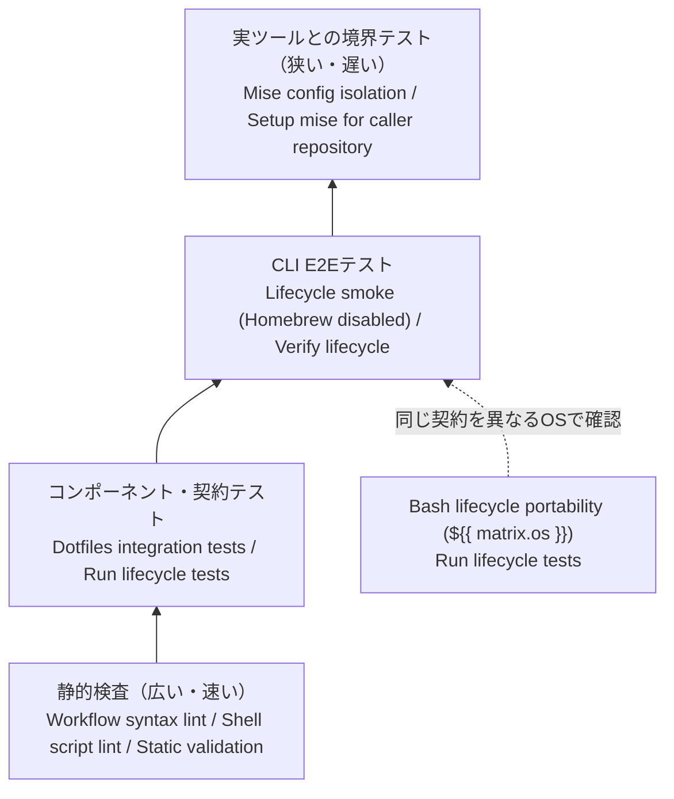

# テスト戦略

この文書は、dotfiles の各レイヤーをどのテストで検証しているかを示します。最初にテストの考え方と「レイヤーごとの責務」を読み、テストを追加・変更するときは「変更に応じたテストの選び方」を参照してください。

## テストピラミッド

テストは、実行が速く対象を細かく切り分けられる単体テストを土台とし、結合テスト、E2Eテストの順に範囲を広げます。上のレイヤーほど実際の利用方法に近づく一方、実行時間と外部要因による不安定さが増すため、テストの数を絞ります。

このリポジトリはUIを持ちませんが、CLIのE2Eテストがあります。[Lifecycle smoke (Homebrew disabled)](../.github/workflows/e2e_smoke.yml) jobの [Verify lifecycle](../.github/workflows/e2e_smoke.yml) stepは、隔離したHOMEで [bin/dotfiles](../bin/dotfiles) を実行し、install / verify / uninstallを入口から終了まで検証します。さらに、実miseを使う境界テストで、テスト用コマンドでは確認できない連携を補います。

## 実環境に近いテストほど対象を絞る

テストは、速く広く実行する静的検査を土台に置きます。その上で、隔離したHOMEとテスト用コマンドを使うコンポーネント・契約テスト、[bin/dotfiles](../bin/dotfiles) を通すCLI E2Eテスト、実miseを使う境界テストの順に実環境へ近づけます。上のレイヤーほど外部要因の影響を受けやすいため、下のレイヤーで確認できない契約に対象を絞ります。

この図はテストの優先順位を示すものではありません。各レイヤーは異なる失敗を検出するため、相互に代替できません。

## レイヤーごとの責務

「手段」には、GitHub Actionsで表示される `job名 / step名` を記載します。

| レイヤー | 主な対象 | 手段 | 守る性質 |
| --- | --- | --- | --- |
| 静的検査 | Bash、JavaScript、GitHub Actions | [Workflow syntax lint](../.github/workflows/lint.yml) / [Run actionlint on workflow files](../.github/workflows/lint.yml)、[Shell script lint](../.github/workflows/lint.yml) / [Run ShellCheck on dotfile scripts](../.github/workflows/lint.yml)、[Static validation](../.github/workflows/lint.yml) / [Run Bash syntax checks](../.github/workflows/lint.yml)・[Run Biome](../.github/workflows/lint.yml) | 構文、危険なshell記述、JavaScriptの品質、workflow定義の妥当性 |
| コンポーネント・契約 | CLIの引数解析、ライフサイクル、パッケージ管理、管理対象のシンボリックリンク、初期導入、テスト用fixture | [Dotfiles integration tests](../.github/workflows/test.yml) / [Run lifecycle tests](../.github/workflows/test.yml) | 終了コードと診断、dry-runとapplyの整合、冪等性、バックアップと巻き戻し、排他制御、利用者データの保護 |
| CLI E2E | [bin/dotfiles](../bin/dotfiles) のinstall、verify、uninstall | [Lifecycle smoke (Homebrew disabled)](../.github/workflows/e2e_smoke.yml) / [Verify lifecycle](../.github/workflows/e2e_smoke.yml) | CLIの入口から各操作の完了まで、利用者向けの一連の動作が成立すること |
| 実ツールとの境界 | リポジトリのmise設定分離、ロックファイル、呼び出し元リポジトリからの利用 | [Mise config isolation](../.github/workflows/test.yml) / [Reject caller and HOME mise configuration](../.github/workflows/test.yml)、[Setup mise for caller repository](../.github/workflows/test.yml) / [Verify caller repository toolchain](../.github/workflows/test.yml) | 親プロセスやHOMEのmise設定が混入しないこと、実miseのCLI契約と整合すること |
| 横断検証 | Bashで実装したライフサイクルとテスト実行環境 | [Bash lifecycle portability (${{ matrix.os }})](../.github/workflows/test.yml) / [Run lifecycle tests](../.github/workflows/test.yml) | OS差によるshell、ファイルシステム、標準コマンドの挙動差 |

### 静的検査は実行前に検出できる問題を広く拾う

ローカルの [make lint](../Makefile) はBashの構文と、`tests/**/*.js` を対象とするBiomeの検査を行います。CIではShellCheckとactionlintも実行し、shellのデータフローやGitHub Actionsの定義まで確認します。

### Node.jsテストは契約とCLI E2Eを隔離環境で検証する

[tests/run.sh](../tests/run.sh) は、miseで固定したNode.jsから機能別のテストを実行します。各ケースは一時ディレクトリにHOMEとテスト用コマンドを作り、開発端末のmise設定や疑似障害用の環境変数を持ち込みません。

テストは内部関数の実装だけでなく、[bin/dotfiles](../bin/dotfiles) を子プロセスとして実行した結果も検証します。install / verify / uninstallをCLIの入口から実行するテストはE2Eにあたります。とくに、既存ファイルを壊さないこと、verifyが修復を行わないこと、dry-runとapplyの計画が一致することを利用者向けの契約として扱います。

### 境界テストはテスト用コマンドでは再現できないmiseの挙動を確認する

[tests/integration/mise-isolation.sh](../tests/integration/mise-isolation.sh) は実miseを使い、呼び出し元やHOMEの設定がリポジトリの検査へ混入しないことを確認します。[Setup mise for caller repository](../.github/workflows/test.yml) jobは、別のリポジトリから共通actionを呼び出しても、指定したツール一式を導入できることを検証します。

実ツールを使うテストは、ネットワークやcacheの影響を受けます。そのため、診断や分岐の網羅はNode.jsテストに置き、ここでは設定分離とCLI境界に対象を限定します。

## 変更に応じて最も低いレイヤーからテストを追加する

| 変更 | 追加・更新するテスト |
| --- | --- |
| 引数、終了コード、診断文を変える | 対応する `tests/*.test.js` |
| ライフサイクル、パッケージ、シンボリックリンクの分岐を変える | テスト用コマンドまたは疑似障害を使うNode.jsテスト |
| fixtureや環境変数の隔離方法を変える | [tests/helpers/fixture.test.js](../tests/helpers/fixture.test.js) |
| miseの設定探索や実CLIへの渡し方を変える | Node.jsテストに加えて [tests/integration/mise-isolation.sh](../tests/integration/mise-isolation.sh) |
| workflowや対応OSを変える | workflowのjob、OS別の実行条件、actionlintの対象 |

ローカルでは、変更箇所に近いテストを先に実行し、最後に [make ci](../Makefile) で静的検査と全テストを通します。CI固有の [Workflow syntax lint](../.github/workflows/lint.yml)、[Shell script lint](../.github/workflows/lint.yml)、[Bash lifecycle portability (${{ matrix.os }})](../.github/workflows/test.yml) の結果はプルリクエストで確認します。

## 実環境でしか確認できない範囲は残る

現在の自動テストは、実際の利用者HOMEに対する変更、Homebrewの実インストール、外部インストールスクリプトの配布状態、WSL固有の差分を直接検証しません。これらをテスト用コマンドで通過させても、実環境での成功を保証したことにはなりません。

外部ツールのversion、checksum、bootstrap処理を変えた場合は、[make ci](../Makefile) に加えて対象環境でdry-runを確認します。実HOMEへ適用する場合は、表示された計画と競合を確認してから `--apply` を実行してください。

## 用語

| 用語 | 意味 |
| --- | --- |
| テスト用コマンド | 本物のmiseやbrewの代わりに実行し、成功、失敗、警告などの応答をテスト側で制御する実行ファイル |
| 疑似障害 | 環境変数などを使い、失敗や競合を意図的に発生させる方法 |
| CLI E2Eテスト | 隔離したHOMEで [bin/dotfiles](../bin/dotfiles) を実行し、CLIの入口からinstall、verify、uninstallの結果までを確認するテスト |
| 境界テスト | 自作コードと実際のshell、filesystem、外部CLIとの接点を確認するテスト |
| 利用者向け契約 | 終了コード、出力、ファイル保持など、内部実装を変えても維持する挙動 |

この文書で扱っていない内部構成は [Architecture](ARCHITECTURE.md)、テストが失敗した場合の確認方法は [Troubleshooting](TROUBLESHOOTING.md) を参照してください。
